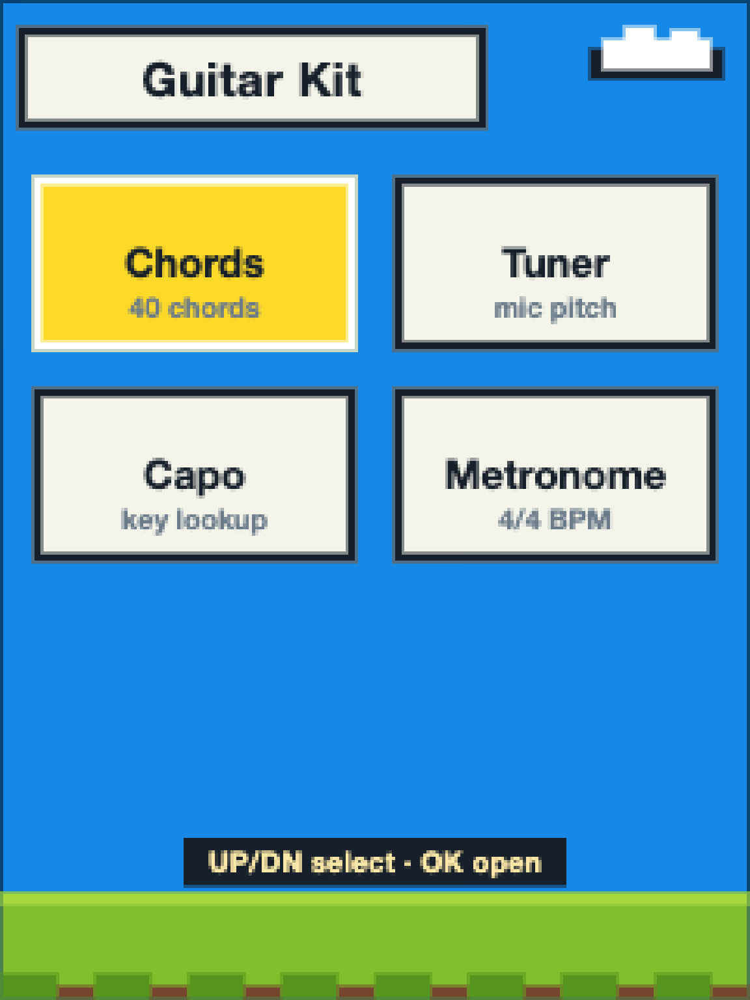
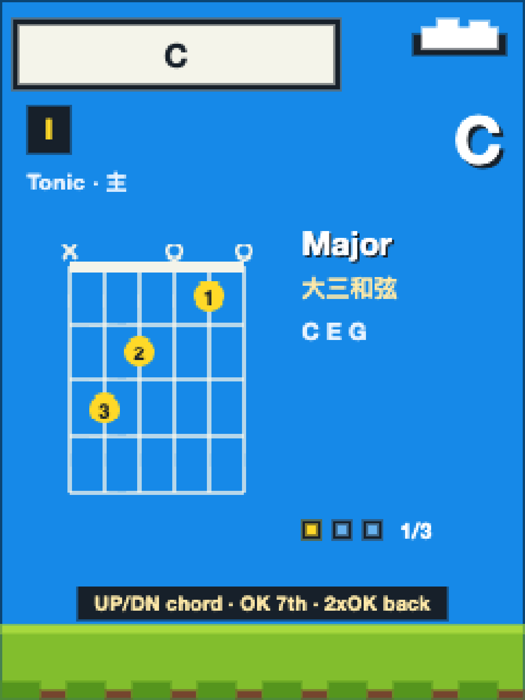
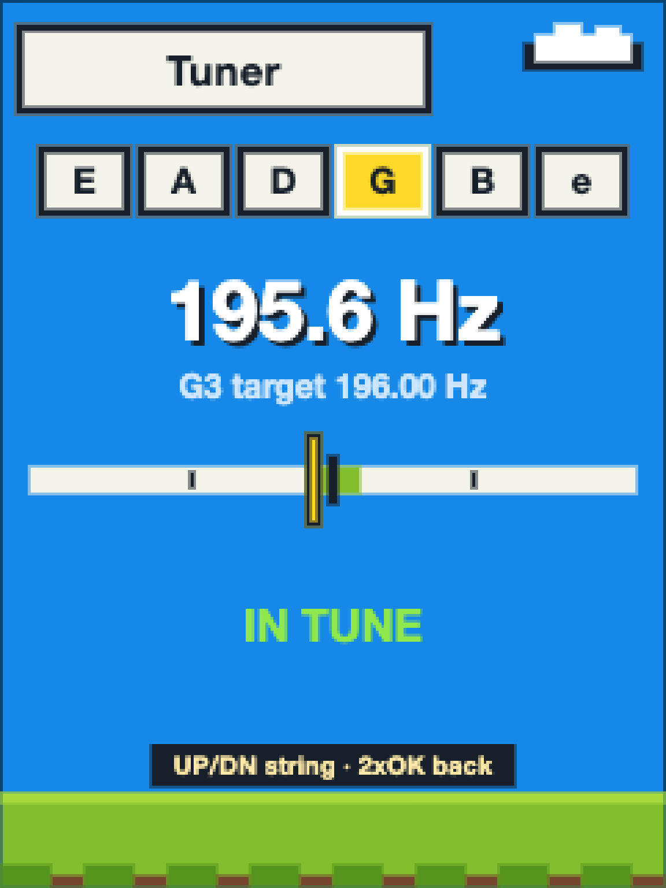
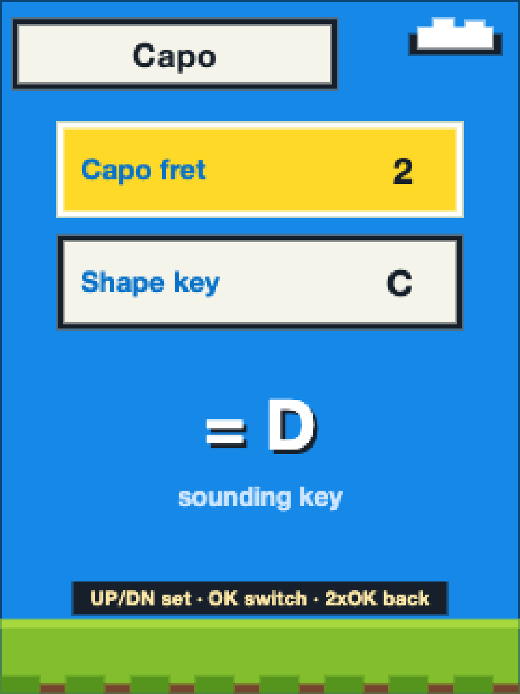
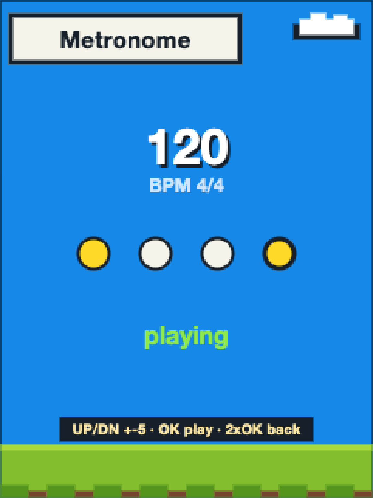

# 吉他工具箱 · Guitar Kit

<p align="center">
  
</p>

> 宣传海报为 AI 生成的视觉示意；下方功能图来自项目自带的交互示意页面，不是实机照片。

一个为吉他初学者设计的设备端小工具箱，跑在 FoloToy AI Passport 上。目前有**四件工具**：

- **Chords 和弦词典** — C 大调 / G 大调全部 7 个级数、40 个指法，三和弦到属七/大七/小七/半减七
- **Tuner 调音器** — 麦克风拾音测频，自动跟弦，±50 音分指针 + IN TUNE 提示
- **Capo 变调夹速查** — 夹 N 品 + 按某调指法 = 实际什么调，一屏换算
- **Metronome 节拍器** — 4/4 拍 40–240 BPM，扬声器合成咔嗒声，拍点动画

本目录是**独立的一套代码**，不依赖 FoloToy AI Passport 基线仓库；板级支持包（`firmware/components/bsp`，MIT 许可）复制自该基线。

## 快速开始

- **看效果**：双击打开 `index.html`（纯静态单文件，无需服务器）。左边是可交互的设备模拟器（鼠标点按键或键盘 `↑` `↓` `Enter`，`L` = 长按 OK），下面附全部 40 个和弦总表与中文说明。
- **跑固件**：见下文构建与烧录。开机直接进工具箱首页。

## 界面预览

开机进入工具箱菜单，用 UP / DOWN 选择功能，按 OK 打开：

<p align="center">
  
</p>

| 和弦词典 | 调音器 |
| --- | --- |
| <br>查看 C、G 大调常用和弦与拓展变体。 | <br>自动识别琴弦，通过指针和文字提示调音方向。 |
| **变调夹速查** | **节拍器** |
| <br>图示为夹 2 品、使用 C 调指法，实际得到 D 调。 | <br>图示为 120 BPM、4/4 拍播放状态。 |

## 交互设计（三键）

| 页面 | UP / DOWN | OK 单击 | OK 双击 | OK 长按 |
| --- | --- | --- | --- | --- |
| 工具箱（HUB，开机即此页） | 选工具 | 进入选中工具 | — | — |
| Chords · 选调 | C 大调 ↔ G 大调 | 进入该调 | 回工具箱 | 回工具箱 |
| Chords · 级数列表（I–vii°） | 移动选中行 | 查看指法 | 回选调 | 回工具箱 |
| Chords · 和弦详情 | 上一个/下一个级数（循环翻页） | 同一根音上循环拓展变体 | 回列表 | 回工具箱 |
| Tuner 调音器 | 选目标弦 | — | 回工具箱 | 回工具箱 |
| Capo 变调夹速查 | 改选中行数值 | 切换"夹几品/指法调" | 回工具箱 | 回工具箱 |
| Metronome 节拍器 | 速度 ±5 BPM（播放中即时生效） | 开始/停止 | 回工具箱（并停止） | 回工具箱（并停止） |

页面底部有操作提示条；固件界面用英文（未内嵌中文字库），HTML 示意页下方有中文对照面板。

**和弦的拓展变体**：每级默认显示调内三和弦，短按 OK 依次切换：

- 大调根音（I、IV、V 级）：三和弦 → 大七（maj7） → 属七（7）
- 小调根音（ii、iii、vi 级）：小三和弦 → 小七（m7） → 属七（7）
- vii° 级：减三和弦 → 半减七（m7♭5）

以后想加 sus4、add9、六和弦，只需在 `chord_model.c` 对应级数的变体表**末尾追加一条**，UI 与按键语义不变。

**加新工具**：在 `chords_ui.c` 的 `HUB_ITEMS` 表加一行（名字/副标题/页面），首页网格自动多一张卡片（两列，单页最多 6 张）；再实现对应的 `PAGE_xxx` 分支即可。节拍器是现成的下一个候选。

## 调音器

ES8311 麦克风 16kHz 单声道采样，每 64ms 一帧做**归一化自相关**测基频（含倍周期校正与抛物线插值），检测范围 60–500Hz，标准调弦 E2 82.41 / A2 110 / D3 146.83 / G3 196 / B3 246.94 / E4 329.63 Hz（A4=440）。自动跟弦：弹哪根亮哪根；指针落在中央 ±5 音分绿色区显示 `IN TUNE`。算法在 `firmware/main/tuner.c`（纯 C，可主机测试），采音任务在 `firmware/main/tuner_audio.c`。

## 变调夹速查

回答初学者最常见的问题："夹 N 品、按 X 调的指法，实际是什么调？"两行选择（夹几品 0–7、指法调 C/G/D/A/E），大字显示实际调名。换算就是 `(指法调 + 夹品数) mod 12`，逻辑在 `firmware/main/capo_model.c`（纯 C，可主机测试）。例如：夹 2 品按 C 指法 = D 调；夹 1 品按 G 指法 = G# 调。

## 节拍器

固定 4/4 拍，速度 40–240 BPM（UP/DOWN 每次 ±5，播放中调整即时生效）。咔嗒声由 ES8311 扬声器合成：小节第一拍 1300Hz 重音、其余 900Hz，50ms 指数衰减；屏幕上四个拍点对应每一拍，当前拍高亮（与声音可能有约 0.1 秒的视觉延迟，来自 I2S 缓冲）。换算与范围在 `firmware/main/metronome.c`（纯 C，可主机测试），发声任务在 `firmware/main/metronome_audio.c`。与调音器共用 ES8311 全双工：节拍器发声不影响麦克风拾音。

## 和弦内容

每级 2~3 个变体，共 40 个指法，全部是开放把位常用按法：

- 小 F（xx3211）、Bm7（x2020x）等给了初学者友好的简化按法，标注 `Easy F` / `Easy grip`
- 横按和弦标注 `Barre` / `Small barre`
- F♯dim 用无低音根音的转位按法（标注 `No low root`）
- 指法图含闷音 ×、空弦 ○、按法点与指法编号（1 食指 … 4 小指）
- **根音标记**：根音所在的弦用橙色加粗、根音点为红色（图例 `orange = root string`），数据在 `root_string` 字段并有主机测试独立校验（必须指向最低的、实际发出根音的弦）

## 目录结构

```
guitar-kit/
├── index.html            交互示意（设备模拟器 + 40 和弦总表 + 中文说明）
├── README.md             本文档
└── firmware/             独立 ESP-IDF 工程
    ├── CMakeLists.txt    工程入口（项目名 guitar-kit）
    ├── partitions.csv    分区表（保留受保护 cardid@0x356000，勿动）
    ├── sdkconfig.defaults  含 LVGL Montserrat 32 字体与 48KB LVGL 内存池
    ├── dependencies.lock 可复现的组件依赖锁定
    ├── components/bsp/   板级支持包（复制自 FoloToy AI Passport 基线, MIT）
    ├── main/             应用代码
    │   ├── main.c        初始化: 显示/按键/麦克风, 开机进工具箱
    │   ├── chords_ui.c/.h  页面状态机与指法图/音分管绘制
    │   ├── chord_model.c/.h  和弦数据(40 指法), 可主机测试
    │   ├── tuner.c/.h    调音算法(自相关测频), 可主机测试
    │   ├── tuner_audio.c/.h  麦克风采音任务(16kHz)
    │   ├── capo_model.c/.h  变调夹换算, 可主机测试
    │   ├── metronome.c/.h  节拍器速度换算, 可主机测试
    │   ├── metronome_audio.c/.h  节拍器播放任务(合成咔嗒声)
    │   └── ui_pixel.c/.h   像素风 UI 组件(取自基线)
    └── tests/            主机测试(run.sh: 和弦指法/测频/变调换算/速度范围)
```

## 构建与烧录

需要 ESP-IDF **v5.5.3**（已安装在 `~/esp/esp-idf-v5.5.3`）：

```bash
cd firmware
source ~/esp/esp-idf-v5.5.3/export.sh
./tests/run.sh                 # 主机测试（无需硬件）
idf.py set-target esp32c3      # 仅首次
idf.py build
idf.py -p /dev/cu.usbmodem101 flash   # 分段烧录, 不会覆盖受保护的 cardid 分区
```

每次构建会额外产出按日期命名的成品 `build/guitar-kit-YYYYMMDD.bin`（与 `guitar-kit.bin` 内容一致），历史日期的文件保留在 build 目录里，方便回溯刷过的版本；`fullclean` 会一并清掉。

注意：设备已开卡时**不要**自己烧录合并的全量镜像（会覆盖 cardid）；自己升级始终用分段 `idf.py flash`。

**提交商店审核**用合并镜像：`tools/merge.sh` 生成 `build/guitar-kit-full-YYYYMMDD.bin`（引导+分区表+应用，从 0x0 起整写、不触及 cardid 保护区），审核流水线要求的就是这种"能从 0x0 刷写"的合并固件。目录改名/移动后需先 `idf.py fullclean` 再 build。

## 假设与已知边界

1. 固件界面文案为英文（设备未内嵌中文字库，引入字库超出本次范围）；
2. 横按和弦直接如实展示并标注，未做难度过滤；
3. 变体选择只在会话内记忆（重启后复位），未做 NVS 持久化；
4. 调音器的静音门限（RMS≥200）为经验值，环境噪声大时可调 `tuner.c` 的 `TUNER_RMS_GATE`；
5. 变调夹品数范围 0–7、指法调限 C/G/D/A/E——初学者常用范围，需要再扩表格即可；
6. 节拍器固定 4/4 拍；节拍动画与声音存在约 0.1 秒的 I2S 缓冲视觉延迟，属正常现象；
7. 自动息屏：无操作 2 分钟关闭背光；息屏后任意按键只唤醒（那次按键不触发动作）；调音页和节拍器播放中不熄屏；
7. 真机已验证：启动日志、麦克风 16kHz 就绪、节拍器任务就绪；拾音精度、咔嗒声音量与节拍器页的实际显示请上手确认。
6. 真机已验证：启动日志、麦克风 16kHz 就绪；拾音精度与变调夹页的实际显示请上手确认。
